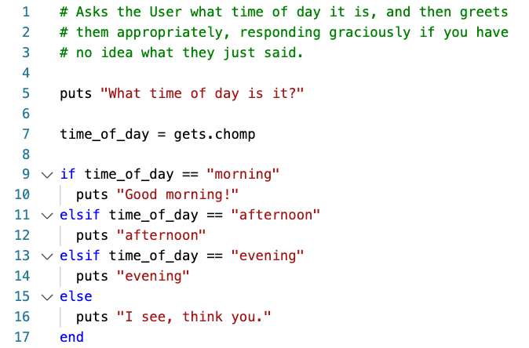

class: middle, center

# Jumpstart Live

In classroom conversation for day 1

---

# Hello

Introduce yourself!
* Name
* Pronouns
* What you were doing before Ada **OR** something interesting about yourself

---

# Agenda

1.  Welcomes (already done)
2.  Learning Goals
3.  Reviewing Candy Machine
4.  Getting Familiar with our editor
5.  Ruby Style Guide
6.  Ruby data types & assignment statements
7.  Time to work Day 2 Exercises
8.  Debrief

---

# Peer code review: Candy Machine

Pointers for code review:
* Ruby style guides: snake_case, spaces, comments, indentation

* Are all minimal requirements followed and working?

* Are any additional, optional requirements coded and working?

* User experience
    * Are the prompts useful, educational, and sufficient for the user of the
      program who is unaware of the requirements?

    * What is the user enters information in an incorrect format? (case
      insensitive input, detailed error messages, prompt for re-entry)

P.S: for easier code reviews, save files with `.rb` extensions in your gists.
This allows for better formatting. Saving multiple `.rb` files helps scope the
feedback and test code as you make changes.

---

# Workflow

Goal
* Be comfortable writing and executing programs on your machine

Tools needed
* VS Code, or another text editor
* terminal, or another terminal emulator such as iTerm2
* ruby
    * What version do you have? Run **`ruby --version`** in a terminal
* irb

---

# Turn This

---

# Into This

---

# Lets Try VS Code & Terminal

On your computer

- Start up Terminal
- Create a folder called `Ada` if you do not already have it with:
  - `$ mkdir Ada`
- Change into that folder with:
  - `$ cd Ada`
- Then create a JSL folder
  - `$ mkdir JSL`
  - `$ cd JSL`
- Then create a day1 folder and move into that folder.
  - `$ mkdir day1`
  - `$ cd day1`
- Create a ruby file and open it in VS Code:
  - `$ touch hello.rb`
  - `$ code .`

Then lets create and run this file/

---

# Ruby Style

## Goal

- To write Ruby code that is easy to understand and maintain.
- Tools Needed
  - [Ruby Style guide https://github.com/rubocop-hq/ruby-style-guide](https://github.com/rubocop-hq/ruby-style-guide)

- Mention of Rubocop

---

# These Two Programs Do The Same Thing

What would you do to improve'em?

 

---

# A Good Code Style Sample

---

# Ruby Data Types

| Data Type  	| Description 	| Example 	|
|---	|---	|---	|
| String 	| Anything surrounded by single/double quotes 	| "hello", 'hello' 	|
| Integer 	| A number with no decimal 	| 1, 0, -7 	|
| Float 	| A "real" value (decimal) 	| 0.5, -2.75 	|
| Array 	| An ordered list of values 	| ['hey', 3, 7] 	|
| Symbol 	| A named object 	| :apple 	|
| Hash 	| A set of key-value pairs 	| { A: 2, B: 3, C: 27 } 	|
| Range 	| A set of values with a beginning & end 	| (2..6) or (2...7) 	|

**Question** How do you convert from one to another?

Useful tools, irb &  the `.class` method.

---

# Lets **do* something!

Goal:  
- Practice writing a program which uses keyboard input.

Exercise:

- Create a program which calculates the square footage of a room given the user enters the dimensions of the room 
- Use `gets.chomp`

---

# Example Solution

---

# Strings Practice

- Create a program that makes only one variable (a string) and prints it out to the user.
  - The string must span multiple lines when printed
  - It should include a contraction (don’t, can’t, I’m, etc..)
  - It must also include a user-supplied string within it

---

# Is there another solution?

---

# Another Solution

---

# Assignment - When you give a set a variable to a value

---

# Assignment - When you give a set a variable to a value

---

# Working on JSL Day 2

Get a jump start on day 2 exercises
https://github.com/Ada-Developers-Academy/jump-start-live/blob/master/lessons/day2/readme.md#exercises

---

# Debrief

- What new things did you learn today?
- What topics are you still struggling with?
- What did you especially enjoy about today's class?
- What can be improved for future classes?

---