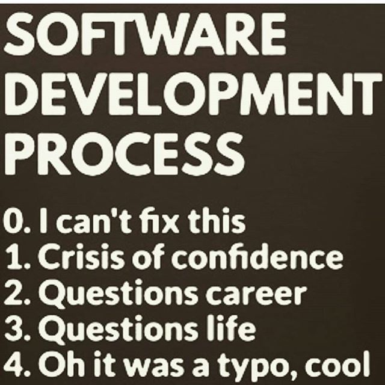

class: middle, center

# JumpStart Live

In classroom conversation for day 3

Rename yourself in Zoom with your name & pronouns

---

# Software Development Process



---

# Warmup

Share what you learned from our last session about conditionals (if, else if, else…)

Have a classmate code review your election time code (and vice versa).

* Is it clear what the program is doing?
* Are there sufficient comments?
* Does the control flow of the program make sense?
* Does the code follow the ruby style guide?
* Is there repeated code anywhere?
* Are edge cases appropriately handled?

Focus on using programming vocabulary (e.g, blocks, loops, iterator, variable assignment, conditional statement) and be as precise as possible when reviewing.

---

# Loops

Code that can be repeated more than once

What's the difference between the following types of loops?

* Sentinel Controlled
* Counter Controlled
* Iteration through a collection
* Infinite


---

# Sentinel Controlled

.left-column[
    While Loop

```ruby
while <something is true>
  # do stuff
end
```
]

.right-column[
    Until Loop

```ruby
until <something is false>
  # do stuff
end
```
]

--

## When would you use an `until` instead of a `while`?

---

# Convert to an until loop

.left-column[
    ```ruby
    puts "Hello we're going to total 
      some numbers!"
    puts "Enter a negative number 
      to quit."

    total = 0
    input = gets.chomp.to_i

    while input > -1
      total += input
      input = gets.chomp.to_i
    end

    puts "Total is #{total}"
    ```
]

--

.right-column[
    ```ruby
    puts "Hello we're going to total 
      some numbers!"
    puts "Enter a negative number 
      to quit."

    total = 0
    input = gets.chomp.to_i

    until input <= -1
      total += input
      input = gets.chomp.to_i
    end

    puts "Total is #{total}"
    ```
]

---

# Counter Controlled

## Times Loop

```ruby
<Integer>.times do |i|  # i is optional
  # code goes here
end
```

--

When do you use such a loop?

---

# What kind of loop is this?

```ruby
print "Do you like dogs or cats?"
pet = gets.chomp.downcase

until pet == "dogs"
  puts "How rude!  I don't believe you, how can anyone not prefer dogs!"
  print "Come now, tell me truthfully, do you like cats or dogs?"
end

puts "Oh you like dogs now too!  We'll be such good friends!"
```

--

## Infinite!

---

# Iterators

Useful for looping over a collection

.left-column[
```ruby
  numbers = [1, 2, 3, 4, 5]
  numbers.each do |number|
    puts number
  end
```
]

.right-column[
  Iterator

  ```ruby
  numbers = [1, 2, 3, 4, 5]
*numbers.each do |number|
   puts number
  end
```

  Block
  ```ruby
    numbers = [1, 2, 3, 4, 5]
  numbers.each do |number|
*   puts number
*  end
  ```
]

---

# What kind of loop is this?

.left-column[
    ```ruby
    numbers = [1, 2, 3, 4, 5]
    numbers.each do |number|
      puts number
    end
    ```
]

--

.right-column[
    What about now?

```ruby
numbers = [1, 2, 3, 4, 5]
numbers.each do |number|
  puts number
  numbers.push(number * 2)
end
```    
]

---

# Local Variables & Scope

Lets look at the [JSL text on scope](https://github.com/Ada-Developers-Academy/jump-start-live/blob/master/lessons/day3/scope.md#local-variables-and-scope)

--

## Summary

* When you define a local variable inside of a block, it is not visible outside of that block.


---

# What's The Scope of `spirit_animal`?

```ruby
names = ["Brooks", "Dee", "Devin", "Becca", "Jared"]
names.each do |name|
  print "What is the spirit animal of #{name}?\t"
  spirit_animal = gets.chomp
  puts "\t#{spirit_animal} is mine too!"
end

puts "Spirit Animal is #{spirit_animal}"
```

---

# What is the scope of spirit animal here?

```ruby
print "What's your first name?"
name = gets.chomp.capitalize

if name.start_with?("A")
  print "What is your spirit animal?"
  spirit_animal = gets.chomp
end

puts "Your spirit animal is #{spirit_animal}"
```

---

# Exercises

Lets review on [Number Guessing Game from Unit 3](https://learn-2.galvanize.com/cohorts/2036/blocks/748/content_files/03-pre-ada03/04-exercise/04-exercise.checkpoint.md?assessment=true)


---

# Debrief

* What new things did you learn today?
* What topics are you still struggling with?
* What did you especially enjoy about today's class?
* What can be improved for future classes?

---

# Pre-Ada Day 3 Survey

[Please give us feedback!](https://airtable.com/shraPA0Opxd8fzOmY)
